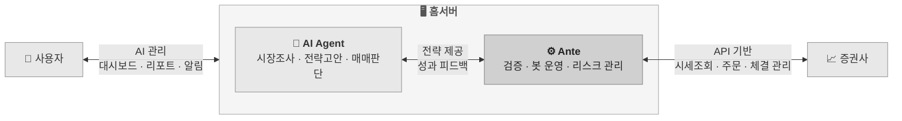

# Ante Up. Agents Do the Rest.

Ante는 AI Agent를 위한 개인 홈서버용 자동 주식 매매 시스템입니다.

당신의 AI 에이전트가 매매 전략을 고안하면, Ante는 그 전략을 검증하고 실제 매매를 수행합니다. 
그리고 결과를 다시 돌려주어 AI 에이전트가 더 나은 전략을 만들 수 있도록 돕습니다.

---

## 구조와 특징

Ante는 세가지 주체의 협업으로 동작 합니다.

---

## Ante가 하는 일

1. **전략 검증** — Agent가 제출한 전략을 정적 분석과 백테스트로 검증합니다.
2. **매매 실행** — 채택된 전략에 따라 봇이 실제 주문을 수행합니다.
3. **안전 관리** — 전역·전략별 거래 규칙으로 손실을 통제하고, 이상 상황 시 자동으로 개입합니다.
4. **성과 피드백** — 거래 기록과 성과 지표를 축적하여 전략 개선의 근거를 제공합니다.

---

## Ante가 하지 않는 일

Ante는 인프라입니다. 아래는 AI Agent의 영역이며, Ante는 관여하지 않습니다.

1. **시장 분석** — 뉴스, 공시, 재무제표, 기술적 지표 해석은 Agent가 수행합니다.
2. **전략 설계** — 어떤 종목을, 언제, 얼마나 사고팔지 결정하는 것은 Agent의 몫입니다.
3. **매매 판단** — 진입·청산 시점, 포지션 크기, 손절·익절 기준은 전략이 정의합니다.
4. **전략 개선** — 성과 피드백을 바탕으로 전략을 수정하고 재제출하는 것은 Agent가 합니다.

> Ante는 Agent의 판단을 제약하지 않습니다. 전략의 자유도를 최대한 보장하되, 리스크 규칙 내에서 안전하게 실행하는 것이 Ante의 역할입니다.

---

## 사용자가 하는 일

사용자는 이 시스템의 대표입니다. 직접 매매하거나 전략을 코딩할 필요는 없습니다.

1. **Agent 등록** — AI 에이전트를 등록하고, 활동 범위(scope)를 설정합니다.
2. **전략 채택** — Agent가 제출한 전략을 검토하고, 실전 투입 여부를 결정합니다.
3. **봇 운용** — 봇의 시작·중지, 예산 배분, 거래 모드(가상/실전)를 관리합니다.
4. **리스크 설정** — 전역·전략별 손실 한도, 거래 규칙을 설정합니다.
5. **모니터링** — 대시보드와 알림으로 운용 현황을 확인합니다.

---

## 문서 안내

| 문서 | 설명 |
|------|------|
| [Getting Started](guide/getting-started.md) | 설치, 초기 설정, 첫 실행 |
| [CLI Reference](guide/cli.md) | 사용 가능한 모든 명령어 |
| [Strategy Guide](guide/strategy.md) | 투자 전략 작성법 |
| [Agent Guide](guide/agent.md) | AI 에이전트 등록 및 활용 |
| [Dashboard](guide/dashboard.md) | 웹 대시보드 사용법 |
| [Security](guide/security.md) | 보안 주의사항 |
