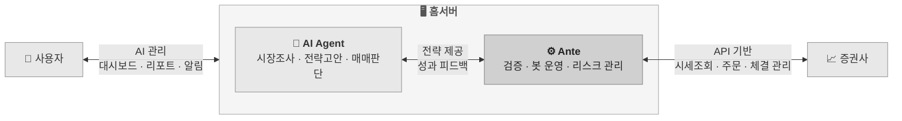

# Ante Up. Agents Do the Rest.

Ante는 AI Agent를 위한 개인 홈서버용 자동 주식 매매 시스템입니다.

당신의 AI 에이전트가 매매 전략을 고안하면, Ante는 그 전략을 검증하고 실제 매매를 수행합니다. 
그리고 결과를 다시 돌려주어 AI 에이전트가 더 나은 전략을 만들 수 있도록 돕습니다.

---

## 구조와 특징

Ante는 세가지 주체의 협업으로 동작 합니다.

| 역할 | 주체 | 담당 |
|------|------|------|
| 대표 | 사용자 | 전략 채택, 봇 운용, 최종 판단 |
| 직원 | AI Agent | 시장 조사, 전략 고안, 리포트 제출 |
| 인프라 | Ante 시스템 | 전략 검증, 매매 실행, 안전 관리, 성과 피드백 |

---

## Ante가 하는 일

1. **전략 검증** — Agent가 제출한 전략을 정적 분석과 백테스트로 검증합니다.
2. **매매 실행** — 채택된 전략에 따라 봇이 실제 주문을 수행합니다.
3. **안전 관리** — 전역·전략별 거래 규칙으로 손실을 통제하고, 이상 상황 시 자동으로 개입합니다.
4. **성과 피드백** — 거래 기록과 성과 지표를 축적하여 전략 개선의 근거를 제공합니다.

---

## 문서 안내

| 대상 | 문서 |
|------|------|
| 개발·유지보수 에이전트 | [CLAUDE.md](CLAUDE.md) |
| 전략 개발·운용 에이전트 | [AGENT.md](AGENT.md) |
| 시스템 아키텍처 | [docs/architecture.md](docs/architecture.md) |
| 모듈별 설계 스펙 | [docs/specs/](docs/specs/) |
