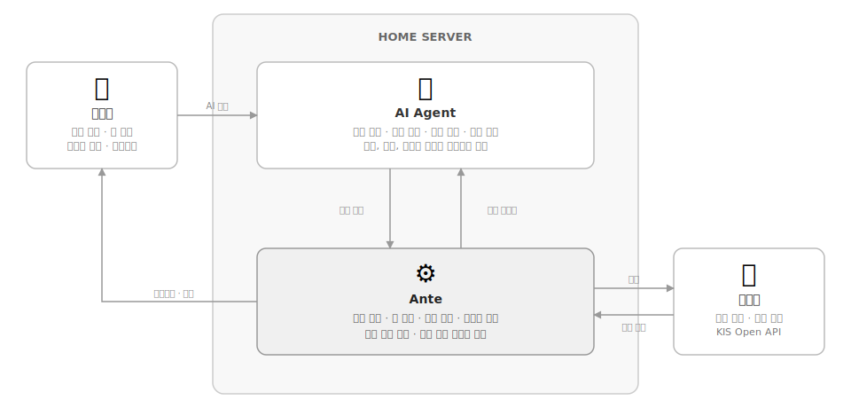

# Ante Up. Agents Do the Rest.

**Ante는 AI Agent를 위한 개인 홈서버 기반 자동 주식 매매 시스템입니다.**

---

## Why Ante?

기존 자동매매 시스템은 전략, 검증, 실행, 리스크 관리가 룰 기반으로 강하게 결합되어 있습니다. 

Ante는 이 결합을 분리합니다.

전략은 AI Agent에게 일임하고, Ante는 전략을 검증하고 실행합니다.  
이 구조를 통해 전략은 유연하게 변경될 수 있으며, 실행과 리스크 관리는 독립적으로 유지됩니다.

---

## How it works

  

Ante와 AI Agent 그리고 사용자는 위와 같은 역할을 맡아 서로 협력합니다.

- Agent가 전략을 생성합니다.
- Ante가 해당 전략을 검증합니다.
- 검증된 전략이 실제 매매에 적용됩니다.
- 거래 결과는 다시 Agent에 전달됩니다.

이 과정은 반복되며, 전략은 결과를 기반으로 재조정 가능합니다.

---

## ⚙️ Ante의 역할

Ante는 전략을 안전하게 실행하는 인프라입니다.

1. 전략 검증
    - 정적 분석
    - 백테스트
2. 매매 실행
    - API 기반 자동 주문
    - 체결 및 상태 관리
3. 리스크 관리
    - 손실 한도 제한
    - 전략별 규칙 적용
    - 이상 상황 자동 개입
4. 성과 피드백
    - 거래 로그 축적
    - 성과 지표 제공
    - 전략 개선을 위한 데이터 반환

👉 [Getting Started](guide/getting-started.md)에서 설치 및 실행 방법을 확인하세요.

---

## 🤖 AI Agent의 역할

아래는 모두 AI Agent의 책임 영역입니다:

- 시장 분석 (뉴스, 재무, 지표 해석)
- 전략 설계 (종목, 타이밍, 비중)
- 매매 판단 (진입/청산/포지션)
- 전략 개선

전략의 자유도는 최대한 보장하되, 리스크 규칙 내에서 안전하게 실행합니다.

👉 [Strategy Guide](guide/strategy.md)와 [CLI Reference](guide/cli.md)에서 투자 전략 작성 및 실행 방법을 확인하세요.

---

## 👤 사용자의 역할

사용자는 직접 매매하거나 전략을 코딩할 필요는 없습니다. 
시스템의 운영자이자 최종 의사결정권자입니다.

- Agent 등록 및 관리
- 전략 검토 및 채택
- 봇 실행 / 중지 / 예산 설정
- 리스크 정책 정의
- 대시보드 및 알림 모니터링

👉 [Agent Guide](guide/agent.md)와 [Dashboard](guide/dashboard.md)에서 AI 에이전트 등록 및 활용법을 확인하세요.

---

## ⚠️ 주의
이 프로젝트는 실제 자금을 다루는 시스템입니다.
충분한 테스트(백테스트 / 모의투자) 후 사용하세요.

👉 Ante는 완벽하지 않습니다. [Security](guide/security.md)에서 보안 주의사항을 확인하세요.
