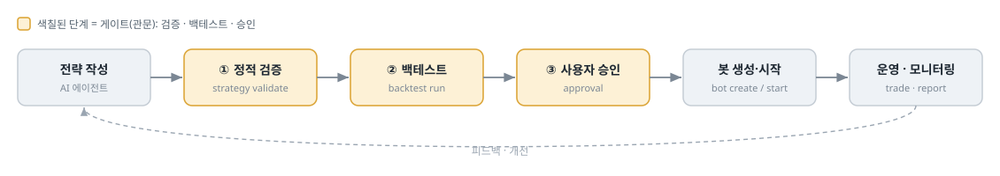

# Ante Up. Agents Do the Rest.


-blue)


> 🤖 **이 글을 읽는 AI 에이전트라면** → 먼저 [`llms.txt`](llms.txt)를 보세요. Ante를 압축적으로 이해하고, 당신의 주인에게 설명하기 위한 컨텍스트가 담겨 있습니다.

Ante는 AI 에이전트 트레이딩 지원을 위한 개인용 자동매매 인프라입니다.

기존 자동매매 시스템들은 자율성이 부족하고 다양한 전략을 구사하기에 경직된 구조가 많았고, 그렇다고 AI 에이전트에게 트레이딩의 전권을 맡기기엔 리스크가 있었습니다.

Ante는 트레이딩 안전 게이트로 기능하여 AI 에이전트의 잠재성을 최대한 지원하려는 목적을 가지고 있습니다.

## 핵심 개념

Ante는 트레이딩 전략을 만들지 않습니다. AI 트레이더를 지원하는 **백오피스 인프라**의 역할만 합니다.

Ante를 활용하여 트레이딩을 수행하기 위해서는 아래 3가지 요소가 필요합니다.

- **프론트오피스 = AI 에이전트** — 시장을 보고 전략을 짜서 매매를 결정합니다. (자율)
- **백오피스 = Ante** — 검증·룰·승인으로 거르고, 체결 후 정산·기록합니다. (게이트)
- **오너 = 사용자** — 무엇을 운용할지 최종 결정합니다.

AI 에이전트는 무엇을 어떻게 거래할지 자율적으로 판단하여 **전략**의 형태로 Ante에 제출합니다.

Ante는 전략에 대한 정적 검증 및 백테스트를 지원하고, 사용자가 승인하면 봇에 전략을 탑재해 실제 매매를 수행합니다.
그리고 매매를 모니터링하며 성과를 기록하고, 의도치 않은 리스크 상황으로부터 자산을 보호합니다.

<p align="center">
  
</p>

👉 보다 상세한 내용은 [핵심 개념](guide/concepts.md)에서 봅니다.

## 빠른 시작

```bash
pip install ante
ante init                                                  # 설정 디렉토리·master 멤버·기본 계좌 생성
ante strategy validate strategies/my_strategy.py           # 전략 정적 검증
ante backtest run strategies/my_strategy.py \
  --start 2025-01-01 --end 2025-12-31 --symbols 005930     # 백테스트
```

👉 설치부터 첫 봇 가동까지는 [시작하기](guide/getting-started.md)를 따라가세요.

## 문서

- [핵심 개념](guide/concepts.md) — 무엇이 있고 어떻게 동작하는가 (개념·다이어그램·워크플로우)
- [모듈과 운영 영역](guide/modules.md) — 주요 모듈의 의미와 CLI 명령 그룹이 제어하는 대상
- [시작하기](guide/getting-started.md) — 설치와 초기 설정
- [전략 작성](guide/strategy.md) — 전략 클래스·시그널·지표
- [에이전트 가이드](guide/agent.md) — 에이전트 등록·인증·활용
- [CLI 레퍼런스](guide/cli.md) — 전체 명령어 (`--format json` 지원)
- [보안](guide/security.md) — 보안 주의사항
- [기여 가이드](CONTRIBUTING.md) — 외부 fork PR 기여 계약
- [보안 정책](SECURITY.md) — 취약점 비공개 신고 절차

## ⚠️ 주의

이 프로젝트는 실제 자금을 다루는 시스템입니다. 충분한 테스트(백테스트·모의투자) 후 사용하세요. Ante는 완벽하지 않습니다 — [보안 주의사항](guide/security.md)을 먼저 확인하세요.

KIS 신세대 REST 계약(주문/취소/체결조회)은 **모의투자 환경에서만 검증**됐습니다. 실전투자 경로(체결조회 `TTTC0081R`·정정취소 `TTTC0013U`·`CTSC9215R`)는 미검증이며, 실전 전환 전 사용자 oracle A/B 검증이 필요합니다. 상세·전환 체크리스트: `docs/specs/broker-adapter/18-fill-recovery.md` §11.6/§11.7.

## 라이선스

[MIT](LICENSE)
