# Ante DB Schema

> 이 문서는 `src/ante/` 소스 코드에서 추출한 SQLite 스키마입니다.
> 코드 변경 시 이 문서도 함께 최신화해 주세요.
>
> 마지막 갱신: 2026-03-25

모든 모듈은 중앙 `Database` 인터페이스를 통해 SQLite WAL 모드 DB에 접근한다.
DB 파일 경로는 `config/system.toml`의 `database.path` (기본: `db/ante.db`)에서 결정된다.

**통계**: 테이블 25개 · 인덱스 27개 · 16개 모듈

---

## ER 다이어그램

> VS Code: `Markdown Preview Mermaid Support` 확장 필요 · GitHub: 네이티브 렌더링 지원
>
> SQLite에 외래 키 제약 조건은 선언하지 않았다 (단일 프로세스에서 애플리케이션 레벨로 정합성 보장).

```mermaid
erDiagram
    %% ─── Account 도메인 ───
    accounts {
        TEXT account_id PK
        TEXT name
        TEXT exchange
        TEXT currency
        TEXT trading_mode
        TEXT broker_type
        TEXT credentials
        TEXT broker_config
        REAL buy_commission_rate
        REAL sell_commission_rate
        TEXT status
        TEXT created_at
        TEXT updated_at
    }

    %% ─── Bot 도메인 ───
    bots {
        TEXT bot_id PK
        TEXT name
        TEXT strategy_id "FK"
        TEXT account_id "FK → accounts"
        TEXT config_json
        BOOLEAN auto_start
        TEXT status
        TEXT created_at
        TEXT updated_at
    }

    strategies {
        TEXT strategy_id PK
        TEXT name
        TEXT version
        TEXT filepath
        TEXT status
        TEXT registered_at
        TEXT description
        TEXT author_name
        TEXT author_id
        TEXT rationale
        TEXT risks
        TEXT validation_warnings
    }

    signal_keys {
        TEXT key_id PK
        TEXT bot_id "FK → bots, UNIQUE"
        TEXT created_at
    }

    %% ─── Trade 도메인 ───
    trades {
        TEXT trade_id PK
        TEXT bot_id "FK"
        TEXT account_id "FK → accounts"
        TEXT strategy_id "FK"
        TEXT symbol
        TEXT side
        REAL quantity
        REAL price
        TEXT status
        TEXT order_type
        TEXT reason
        REAL commission
        TEXT currency
        TEXT timestamp
        TEXT order_id
        TEXT exchange
        TEXT created_at
    }

    positions {
        TEXT bot_id PK "FK → bots"
        TEXT symbol PK
        TEXT account_id "FK → accounts"
        REAL quantity
        REAL avg_entry_price
        REAL realized_pnl
        TEXT exchange
        TEXT updated_at
    }

    position_history {
        INTEGER id PK
        TEXT bot_id "FK"
        TEXT account_id "FK → accounts"
        TEXT symbol
        TEXT action
        REAL quantity
        REAL price
        REAL pnl
        TEXT trade_id
        TEXT timestamp
        TEXT exchange
        TEXT created_at
    }

    %% ─── Treasury 도메인 ───
    bot_budgets {
        TEXT bot_id PK "FK → bots"
        TEXT account_id "FK → accounts"
        REAL allocated
        REAL available
        REAL reserved
        REAL spent
        REAL returned
        TEXT last_updated
    }

    treasury_transactions {
        INTEGER id PK
        TEXT account_id "FK → accounts"
        TEXT bot_id "FK"
        TEXT transaction_type
        REAL amount
        TEXT description
        TEXT created_at
    }

    treasury_state {
        TEXT account_id PK "FK → accounts"
        REAL account_balance
        REAL purchasable_amount
        REAL total_evaluation
        TEXT currency
        TEXT last_synced_at
    }

    %% ─── Broker 도메인 ───
    order_registry {
        TEXT order_id PK
        TEXT bot_id "FK"
        TEXT symbol
        TEXT exchange
        TEXT created_at
    }

    %% ─── Config 도메인 ───
    dynamic_config {
        TEXT key PK
        TEXT value
        TEXT category
        TEXT updated_at
    }

    system_state {
        TEXT key PK
        TEXT value
        TEXT updated_at
    }

    system_state_history {
        INTEGER id PK
        TEXT old_state
        TEXT new_state
        TEXT reason
        TEXT changed_by
        TEXT created_at
    }

    %% ─── EventBus 도메인 ───
    event_log {
        INTEGER id PK
        TEXT event_id
        TEXT event_type
        TEXT timestamp
        TEXT payload
        TEXT created_at
    }

    %% ─── Approval 도메인 ───
    approvals {
        TEXT id PK
        TEXT type
        TEXT status
        TEXT requester
        TEXT title
        TEXT body
        TEXT params
        TEXT reviews
        TEXT history
        TEXT reference_id
        TEXT expires_at
        TEXT created_at
        TEXT resolved_at
        TEXT resolved_by
        TEXT reject_reason
    }

    %% ─── Report 도메인 ───
    reports {
        TEXT report_id PK
        TEXT strategy_name "FK"
        TEXT strategy_version
        TEXT strategy_path
        TEXT status
        TEXT submitted_at
        TEXT submitted_by
        TEXT backtest_period
        REAL total_return_pct
        INTEGER total_trades
        REAL sharpe_ratio
        REAL max_drawdown_pct
        REAL win_rate
        TEXT summary
        TEXT rationale
        TEXT risks
        TEXT recommendations
        TEXT detail_json
        TEXT user_notes
        TEXT reviewed_at
    }

    %% ─── Member 도메인 ───
    members {
        TEXT member_id PK
        TEXT type
        TEXT role
        TEXT org
        TEXT name
        TEXT emoji
        TEXT status
        TEXT scopes
        TEXT token_hash
        TEXT password_hash
        TEXT recovery_key_hash
        TEXT created_at
        TEXT created_by
        TEXT last_active_at
        TEXT suspended_at
        TEXT revoked_at
        TEXT token_expires_at
    }

    %% ─── Notification 도메인 ───
    notification_history {
        INTEGER id PK
        TEXT level
        TEXT title
        TEXT message
        TEXT adapter_type
        BOOLEAN success
        TEXT error_message
        TEXT event_type
        TEXT bot_id
        TEXT created_at
    }

    %% ─── Instrument 도메인 ───
    instruments {
        TEXT symbol PK
        TEXT exchange PK
        TEXT name
        TEXT name_en
        TEXT instrument_type
        TEXT logo_url
        INTEGER listed
        TEXT updated_at
    }

    %% ─── Config 도메인 (변경 이력) ───
    dynamic_config_history {
        INTEGER id PK
        TEXT key "FK → dynamic_config"
        TEXT old_value
        TEXT new_value
        TEXT changed_by
        TEXT changed_at
    }

    %% ─── Web 도메인 ───
    sessions {
        TEXT session_id PK
        TEXT member_id "FK → members"
        TEXT created_at
        TEXT expires_at
        TEXT ip_address
        TEXT user_agent
    }

    %% ─── Audit 도메인 ───
    audit_log {
        INTEGER id PK
        TEXT member_id "FK → members"
        TEXT action
        TEXT resource
        TEXT detail
        TEXT ip
        TEXT created_at
    }

    %% ─── Backtest 도메인 ───
    backtest_runs {
        TEXT run_id PK
        TEXT strategy_name
        TEXT strategy_version
        TEXT params_json
        REAL total_return_pct
        REAL sharpe_ratio
        REAL max_drawdown_pct
        INTEGER total_trades
        REAL win_rate
        TEXT result_path
        TEXT created_at
    }

    %% ─── 관계 ───
    accounts ||--o{ bots : "account_id"
    bots ||--o| signal_keys : "bot_id"
    bots ||--o{ trades : "bot_id"
    bots ||--o{ positions : "bot_id"
    bots ||--o{ position_history : "bot_id"
    bots ||--|| bot_budgets : "bot_id"
    bots ||--o{ treasury_transactions : "bot_id"
    bots ||--o{ order_registry : "bot_id"
    strategies ||--o{ bots : "strategy_id"
    strategies ||--o{ trades : "strategy_id"
    strategies ||--o{ reports : "strategy_name"
    dynamic_config ||--o{ dynamic_config_history : "key"
    members ||--o{ sessions : "member_id"
    members ||--o{ audit_log : "member_id"
```



---

## 테이블 목록

| # | 테이블 | 모듈 | 소스 파일 | 설명 |
|---|--------|------|----------|------|
| 1 | `accounts` | Account | `account/service.py` | 계좌 등록 정보 |
| 2 | `bots` | Bot | `bot/manager.py` | 봇 등록 정보 |
| 3 | `signal_keys` | Bot | `bot/signal_key.py` | 봇별 시그널 키 |
| 4 | `strategies` | Strategy | `strategy/registry.py` | 전략 등록 정보 |
| 5 | `trades` | Trade | `trade/recorder.py` | 체결 기록 |
| 6 | `positions` | Trade | `trade/position.py` | 현재 포지션 |
| 7 | `position_history` | Trade | `trade/position.py` | 포지션 변동 이력 |
| 8 | `bot_budgets` | Treasury | `treasury/treasury.py` | 봇별 예산 |
| 9 | `treasury_transactions` | Treasury | `treasury/treasury.py` | 자금 트랜잭션 이력 |
| 10 | `treasury_state` | Treasury | `treasury/treasury.py` | 계좌별 자산 상태 |
| 11 | `treasury_daily_snapshots` | Treasury | `treasury/treasury.py` | 일간 자산 스냅샷 |
| 12 | `order_registry` | Broker | `broker/order_registry.py` | 주문 ID → 봇 매핑 |
| 13 | `dynamic_config` | Config | `config/dynamic.py` | 동적 설정값 |
| 14 | `system_state` | Config | `config/system_state.py` | 시스템 상태 (킬스위치 등) |
| 15 | `system_state_history` | Config | `config/system_state.py` | 시스템 상태 변경 이력 |
| 16 | `event_log` | EventBus | `eventbus/history.py` | 이벤트 감사 로그 |
| 17 | `backtest_runs` | Backtest | `backtest/run_store.py` | 백테스트 실행 이력 |
| 18 | `reports` | Report | `report/store.py` | 전략 리포트 |
| 19 | `approvals` | Approval | `approval/service.py` | 결재 요청 |
| 20 | `members` | Member | `member/service.py` | 멤버 (사용자·에이전트) 등록 정보 |
| 21 | `instruments` | Instrument | `instrument/service.py` | 종목 메타데이터 |
| 22 | `notification_history` | Notification | `notification/service.py` | 알림 발송 이력 |
| 23 | `dynamic_config_history` | Config | `config/dynamic.py` | 동적 설정 변경 이력 |
| 24 | `sessions` | Web | `web/session.py` | 서버사이드 세션 |
| 25 | `audit_log` | Audit | `audit/logger.py` | 멤버 액션 감사 로그 |

---

## DDL

### Account — `accounts`

> 소스: `src/ante/account/service.py`

```sql
CREATE TABLE IF NOT EXISTS accounts (
    account_id   TEXT PRIMARY KEY,
    name         TEXT NOT NULL,
    exchange     TEXT NOT NULL,
    currency     TEXT NOT NULL,
    timezone     TEXT NOT NULL DEFAULT 'Asia/Seoul',
    trading_hours_start TEXT NOT NULL DEFAULT '09:00',
    trading_hours_end   TEXT NOT NULL DEFAULT '15:30',
    trading_mode TEXT NOT NULL DEFAULT 'virtual'
        CHECK(trading_mode IN ('virtual', 'live')),
    broker_type  TEXT NOT NULL,
    credentials  TEXT NOT NULL DEFAULT '{}',     -- 브로커 인증 정보 (JSON, 암호화)
    broker_config TEXT NOT NULL DEFAULT '{}',    -- 브로커 고유 설정 (JSON)
    buy_commission_rate  REAL NOT NULL DEFAULT 0,
    sell_commission_rate REAL NOT NULL DEFAULT 0,
    status       TEXT NOT NULL DEFAULT 'active'
        CHECK(status IN ('active', 'suspended', 'deleted')),
    created_at   TEXT NOT NULL DEFAULT (datetime('now')),
    updated_at   TEXT NOT NULL DEFAULT (datetime('now'))
);
```

### Bot — `bots`

> 소스: `src/ante/bot/manager.py`

```sql
CREATE TABLE IF NOT EXISTS bots (
    bot_id       TEXT PRIMARY KEY,              -- 봇 고유 식별자
    name         TEXT NOT NULL DEFAULT '',       -- 봇 표시 이름
    strategy_id  TEXT NOT NULL,                 -- 실행할 전략 ID (→ strategies.strategy_id)
    account_id   TEXT NOT NULL DEFAULT 'test',  -- 계좌 ID (→ accounts.account_id)
    config_json  TEXT NOT NULL,                 -- 봇 설정 JSON (interval_seconds, symbols 등)
    auto_start   BOOLEAN DEFAULT 0,             -- 1: 시스템 시작 시 자동 구동 | 0: 수동 시작
    status       TEXT DEFAULT 'created',        -- 'created' | 'running' | 'stopping' | 'stopped' | 'error'
    created_at   TEXT DEFAULT (datetime('now')),
    updated_at   TEXT DEFAULT (datetime('now'))
);

CREATE INDEX IF NOT EXISTS idx_bots_account_id ON bots(account_id);
```

### Bot — `signal_keys`

> 소스: `src/ante/bot/signal_key.py`

```sql
CREATE TABLE IF NOT EXISTS signal_keys (
    key_id       TEXT PRIMARY KEY,              -- 시그널 키 (sk_ + 32자 hex)
    bot_id       TEXT NOT NULL UNIQUE,           -- 봇 ID (→ bots.bot_id, 봇당 1개)
    created_at   TEXT DEFAULT (datetime('now'))
);
```

### Strategy — `strategies`

> 소스: `src/ante/strategy/registry.py`

```sql
CREATE TABLE IF NOT EXISTS strategies (
    strategy_id          TEXT PRIMARY KEY,                -- '{name}_v{version}' 형식으로 자동 생성
    name                 TEXT NOT NULL,                   -- 전략 이름
    version              TEXT NOT NULL,                   -- 전략 버전 (예: '1.0.0')
    filepath             TEXT NOT NULL,                   -- 전략 파일 절대 경로 (strategies/ 내)
    status               TEXT NOT NULL DEFAULT 'registered', -- 'registered' | 'active' | 'inactive' | 'archived'
    registered_at        TEXT NOT NULL,                   -- 등록 시각 (ISO 8601)
    description          TEXT DEFAULT '',                 -- 전략 설명
    author               TEXT DEFAULT 'agent',            -- 작성자 ('agent' 또는 사용자명)
    validation_warnings  TEXT DEFAULT '[]'                -- 정적 검증 경고 목록 (JSON 배열)
);
```

### Trade — `trades`

> 소스: `src/ante/trade/recorder.py`

```sql
CREATE TABLE IF NOT EXISTS trades (
    trade_id       TEXT PRIMARY KEY,              -- 거래 고유 ID (이벤트 ID에서 전달, UUID)
    bot_id         TEXT NOT NULL,                 -- 거래를 실행한 봇 ID (→ bots.bot_id)
    strategy_id    TEXT NOT NULL,                 -- 거래를 생성한 전략 ID (→ strategies.strategy_id)
    symbol         TEXT NOT NULL,                 -- 종목 코드
    side           TEXT NOT NULL,                 -- 'buy': 매수 | 'sell': 매도
    quantity       REAL NOT NULL,                 -- 거래 수량
    price          REAL NOT NULL,                 -- 체결가 또는 요청가
    status         TEXT NOT NULL,                 -- 'filled' | 'cancelled' | 'rejected' | 'failed' | 'adjusted'
    order_type     TEXT DEFAULT '',               -- 'market' | 'limit' | 'stop' | 'stop_limit' | ''
    reason         TEXT DEFAULT '',               -- 전략이 제시한 매매 판단 근거
    commission     REAL DEFAULT 0.0,              -- 거래 수수료
    timestamp      TEXT,                          -- 거래 시각 (ISO 8601)
    order_id       TEXT,                          -- 증권사 발급 주문 번호
    exchange       TEXT DEFAULT 'KRX',            -- 거래소 코드 (마이그레이션 추가)
    created_at     TEXT DEFAULT (datetime('now'))
);

CREATE INDEX IF NOT EXISTS idx_trades_bot      ON trades(bot_id, timestamp);
CREATE INDEX IF NOT EXISTS idx_trades_strategy  ON trades(strategy_id, timestamp);
CREATE INDEX IF NOT EXISTS idx_trades_symbol    ON trades(symbol, timestamp);
CREATE INDEX IF NOT EXISTS idx_trades_status    ON trades(status);
```

### Trade — `positions`

> 소스: `src/ante/trade/position.py`

```sql
CREATE TABLE IF NOT EXISTS positions (
    bot_id           TEXT NOT NULL,                -- 포지션 보유 봇 ID (→ bots.bot_id)
    symbol           TEXT NOT NULL,                -- 종목 코드
    quantity         REAL NOT NULL DEFAULT 0,      -- 현재 보유 수량 (0이면 청산 완료)
    avg_entry_price  REAL NOT NULL DEFAULT 0.0,    -- 평균 매입 단가
    realized_pnl     REAL NOT NULL DEFAULT 0.0,    -- 누적 실현 손익
    exchange         TEXT DEFAULT 'KRX',           -- 거래소 코드 (마이그레이션 추가)
    updated_at       TEXT DEFAULT (datetime('now')),
    PRIMARY KEY (bot_id, symbol)                   -- 봇당 종목별 1개 레코드 (복합 PK)
);
```

### Trade — `position_history`

> 소스: `src/ante/trade/position.py`

```sql
CREATE TABLE IF NOT EXISTS position_history (
    id             INTEGER PRIMARY KEY AUTOINCREMENT,
    bot_id         TEXT NOT NULL,                 -- 봇 ID (→ bots.bot_id)
    symbol         TEXT NOT NULL,                 -- 종목 코드
    action         TEXT NOT NULL,                 -- 'buy': 진입/추가매수 | 'sell': 청산/부분청산
    quantity       REAL NOT NULL,                 -- 이 액션의 수량
    price          REAL NOT NULL,                 -- 이 액션의 체결가
    pnl            REAL DEFAULT 0.0,              -- 실현 손익 (매도 시만 계산, 매수 시 0.0)
    timestamp      TEXT,                          -- 액션 발생 시각 (ISO 8601)
    exchange       TEXT DEFAULT 'KRX',            -- 거래소 코드 (마이그레이션 추가)
    created_at     TEXT DEFAULT (datetime('now'))
);

CREATE INDEX IF NOT EXISTS idx_position_history_bot
    ON position_history(bot_id, timestamp);
```

### Treasury — `bot_budgets`

> 소스: `src/ante/treasury/treasury.py`

```sql
CREATE TABLE IF NOT EXISTS bot_budgets (
    bot_id       TEXT PRIMARY KEY,              -- 봇 ID (→ bots.bot_id)
    allocated    REAL NOT NULL DEFAULT 0.0,     -- 봇에 할당된 총 예산
    available    REAL NOT NULL DEFAULT 0.0,     -- 사용 가능 잔액 (= allocated - reserved)
    reserved     REAL NOT NULL DEFAULT 0.0,     -- 진행 중인 주문에 예약된 금액
    spent        REAL NOT NULL DEFAULT 0.0,     -- 체결된 매수 주문의 누적 비용
    returned     REAL NOT NULL DEFAULT 0.0,     -- 매도 체결로 반환된 누적 금액
    last_updated TEXT DEFAULT (datetime('now'))
);
```

### Treasury — `treasury_transactions`

> 소스: `src/ante/treasury/treasury.py`

```sql
CREATE TABLE IF NOT EXISTS treasury_transactions (
    id               INTEGER PRIMARY KEY AUTOINCREMENT,
    bot_id           TEXT,                         -- 관련 봇 ID (→ bots.bot_id, NULL 가능)
    transaction_type TEXT NOT NULL,                -- 'allocate': 예산 할당 | 'deallocate': 예산 회수 | 'fill': 주문 체결
    amount           REAL NOT NULL,                -- 거래 금액
    description      TEXT DEFAULT '',              -- 거래 설명
    created_at       TEXT DEFAULT (datetime('now'))
);
```

### Treasury — `treasury_state`

> 소스: `src/ante/treasury/treasury.py`

```sql
CREATE TABLE IF NOT EXISTS treasury_state (
    account_id         TEXT PRIMARY KEY,           -- 계좌 ID (→ accounts.account_id)
    account_balance    REAL NOT NULL DEFAULT 0,    -- 전체 계좌 잔고
    purchasable_amount REAL NOT NULL DEFAULT 0,    -- 매수 가능 금액
    total_evaluation   REAL NOT NULL DEFAULT 0,    -- 총 평가 금액
    currency           TEXT NOT NULL DEFAULT 'KRW', -- 통화
    last_synced_at     TEXT                         -- 마지막 동기화 시각
);
```

### Broker — `order_registry`

> 소스: `src/ante/broker/order_registry.py`

```sql
CREATE TABLE IF NOT EXISTS order_registry (
    order_id    TEXT PRIMARY KEY,              -- 브로커 발급 주문 ID
    bot_id      TEXT NOT NULL,                 -- 주문을 제출한 봇 ID (→ bots.bot_id)
    symbol      TEXT NOT NULL,                 -- 거래 종목 코드
    exchange    TEXT DEFAULT 'KRX',            -- 거래소 코드 (마이그레이션 추가)
    created_at  TEXT DEFAULT (datetime('now'))
);

CREATE INDEX IF NOT EXISTS idx_order_registry_bot
    ON order_registry(bot_id);
```

### Config — `dynamic_config`

> 소스: `src/ante/config/dynamic.py`

```sql
CREATE TABLE IF NOT EXISTS dynamic_config (
    key       TEXT PRIMARY KEY,                -- 설정 키
    value     TEXT NOT NULL,                   -- JSON 직렬화된 설정 값
    category  TEXT NOT NULL,                   -- 'rule' | 'global_rule' | 'strategy_rule'
    updated_at TEXT DEFAULT (datetime('now'))
);
```

### Config — `system_state`

> 소스: `src/ante/config/system_state.py`

```sql
CREATE TABLE IF NOT EXISTS system_state (
    key        TEXT PRIMARY KEY,               -- 상태 키 (예: 'trading_state')
    value      TEXT NOT NULL,                  -- 상태 값 (예: 'active' | 'reducing' | 'halted')
    updated_at TEXT DEFAULT (datetime('now'))
);
-- key='trading_state' 킬 스위치: active(정상) → reducing(신규 진입 불가, 감축만) → halted(전면 중단)
```

### Config — `system_state_history`

> 소스: `src/ante/config/system_state.py`

```sql
CREATE TABLE IF NOT EXISTS system_state_history (
    id         INTEGER PRIMARY KEY AUTOINCREMENT,
    old_state  TEXT NOT NULL,                  -- 변경 전 상태 값
    new_state  TEXT NOT NULL,                  -- 변경 후 상태 값
    reason     TEXT DEFAULT '',                -- 변경 사유
    changed_by TEXT DEFAULT '',                -- 변경 요청자 (사용자명 또는 'system')
    created_at TEXT DEFAULT (datetime('now'))
);
```

### EventBus — `event_log`

> 소스: `src/ante/eventbus/history.py`

```sql
CREATE TABLE IF NOT EXISTS event_log (
    id          INTEGER PRIMARY KEY AUTOINCREMENT,
    event_id    TEXT NOT NULL,                 -- 이벤트 고유 UUID
    event_type  TEXT NOT NULL,                 -- 이벤트 클래스명 (예: 'OrderFilledEvent')
    timestamp   TEXT NOT NULL,                 -- 이벤트 발생 시각 (ISO 8601)
    payload     TEXT NOT NULL,                 -- 이벤트 데이터 (JSON 직렬화)
    created_at  TEXT DEFAULT (datetime('now'))
);

CREATE INDEX IF NOT EXISTS idx_event_log_type      ON event_log(event_type);
CREATE INDEX IF NOT EXISTS idx_event_log_timestamp  ON event_log(timestamp);
```

### Report — `reports`

> 소스: `src/ante/report/store.py`

```sql
CREATE TABLE IF NOT EXISTS reports (
    report_id          TEXT PRIMARY KEY,           -- 리포트 고유 ID (Agent가 생성)
    strategy_name      TEXT NOT NULL,              -- 전략 이름 (→ strategies.name)
    strategy_version   TEXT NOT NULL,              -- 전략 버전
    strategy_path      TEXT NOT NULL,              -- 전략 파일 경로
    status             TEXT NOT NULL DEFAULT 'submitted', -- 'draft' | 'submitted' | 'reviewed' | 'adopted' | 'rejected' | 'archived'
    submitted_at       TEXT NOT NULL,              -- 제출 시각 (ISO 8601)
    submitted_by       TEXT DEFAULT 'agent',       -- 제출자 ('agent' 또는 사용자명)
    backtest_period    TEXT DEFAULT '',             -- 백테스트 기간 (예: '2024-01 ~ 2026-03')
    total_return_pct   REAL DEFAULT 0.0,           -- 총 수익률 (%)
    total_trades       INTEGER DEFAULT 0,          -- 총 거래 횟수
    sharpe_ratio       REAL,                       -- 샤프 지수 (NULL 가능)
    max_drawdown_pct   REAL,                       -- 최대 낙폭 (%, NULL 가능)
    win_rate           REAL,                       -- 승률 (0.0~1.0, NULL 가능)
    summary            TEXT DEFAULT '',            -- 전략 요약 설명
    rationale          TEXT DEFAULT '',             -- 전략 근거 및 아이디어
    risks              TEXT DEFAULT '',             -- 위험 요소
    recommendations    TEXT DEFAULT '',             -- 개선 및 적용 권고사항
    detail_json        TEXT DEFAULT '{}',           -- 상세 분석 데이터 (JSON)
    user_notes         TEXT DEFAULT '',             -- 사용자 피드백/메모
    reviewed_at        TEXT                         -- 검토 완료 시각 (reviewed/adopted/rejected 시 자동 기록)
);

CREATE INDEX IF NOT EXISTS idx_reports_strategy  ON reports(strategy_name);
CREATE INDEX IF NOT EXISTS idx_reports_status     ON reports(status);
```

### Approval — `approvals`

> 소스: `src/ante/approval/service.py`

```sql
CREATE TABLE IF NOT EXISTS approvals (
    id              TEXT PRIMARY KEY,                -- 결재 요청 고유 ID (UUID)
    type            TEXT NOT NULL,                   -- 결재 유형 ('strategy_adopt' | 'bot_stop' 등)
    status          TEXT NOT NULL DEFAULT 'pending',  -- 'pending' | 'approved' | 'rejected' | 'on_hold' | 'expired' | 'cancelled'
    requester       TEXT NOT NULL,                   -- 요청자 식별 ('agent' 또는 사용자명)
    title           TEXT NOT NULL,                   -- 요청 제목
    body            TEXT NOT NULL DEFAULT '',         -- 본문 (사유, 현황, 기대 효과 등)
    params          TEXT NOT NULL DEFAULT '{}',       -- 실행 파라미터 (JSON)
    reviews         TEXT NOT NULL DEFAULT '[]',       -- 검토 의견 목록 (JSON 배열)
    history         TEXT NOT NULL DEFAULT '[]',       -- 감사 이력 (JSON 배열, action/actor/at/detail)
    reference_id    TEXT DEFAULT '',                  -- 참조 ID (report_id, bot_id 등)
    expires_at      TEXT DEFAULT '',                  -- 만료 시각 (ISO 8601, 빈 문자열이면 무기한)
    created_at      TEXT DEFAULT (datetime('now')),
    resolved_at     TEXT DEFAULT '',                  -- 결정 시각 (approved/rejected/cancelled 시)
    resolved_by     TEXT DEFAULT '',                  -- 결정자
    reject_reason   TEXT DEFAULT ''                   -- 거절 사유
);

CREATE INDEX IF NOT EXISTS idx_approvals_status ON approvals(status);
CREATE INDEX IF NOT EXISTS idx_approvals_type ON approvals(type);
```

### Member — `members`

> 소스: `src/ante/member/service.py`

```sql
CREATE TABLE IF NOT EXISTS members (
    member_id          TEXT PRIMARY KEY,              -- 멤버 고유 식별자
    type               TEXT NOT NULL,                 -- 'human' | 'agent'
    role               TEXT NOT NULL DEFAULT 'default', -- 역할
    org                TEXT NOT NULL DEFAULT 'default', -- 소속 조직
    name               TEXT NOT NULL DEFAULT '',       -- 표시 이름
    emoji              TEXT NOT NULL DEFAULT '',        -- 멤버 이모지
    status             TEXT NOT NULL DEFAULT 'active',  -- 'active' | 'suspended' | 'revoked'
    scopes             TEXT NOT NULL DEFAULT '[]',      -- 권한 범위 (JSON 배열)
    token_hash         TEXT DEFAULT '',                -- 토큰 해시
    password_hash      TEXT DEFAULT '',                -- 비밀번호 해시
    recovery_key_hash  TEXT DEFAULT '',                -- 복구 키 해시
    created_at         TEXT DEFAULT (datetime('now')),
    created_by         TEXT DEFAULT '',                -- 생성자
    last_active_at     TEXT DEFAULT '',                -- 마지막 활동 시각
    suspended_at       TEXT DEFAULT '',                -- 정지 시각
    revoked_at         TEXT DEFAULT '',                -- 폐기 시각
    token_expires_at   TEXT DEFAULT ''                 -- 토큰 만료 시각 (마이그레이션 추가)
);

CREATE INDEX IF NOT EXISTS idx_members_type ON members(type);
CREATE INDEX IF NOT EXISTS idx_members_status ON members(status);
CREATE INDEX IF NOT EXISTS idx_members_org ON members(org);
```

### Instrument — `instruments`

> 소스: `src/ante/instrument/service.py`

```sql
CREATE TABLE IF NOT EXISTS instruments (
    symbol           TEXT NOT NULL,                    -- 종목 코드
    exchange         TEXT NOT NULL,                    -- 거래소 코드
    name             TEXT DEFAULT '',                  -- 종목명 (한글)
    name_en          TEXT DEFAULT '',                  -- 종목명 (영문)
    instrument_type  TEXT DEFAULT '',                  -- 종목 유형 (주식, ETF 등)
    logo_url         TEXT DEFAULT '',                  -- 로고 URL
    listed           INTEGER DEFAULT 1,                -- 상장 여부 (1: 상장, 0: 상장폐지)
    updated_at       TEXT DEFAULT (datetime('now')),
    PRIMARY KEY (symbol, exchange)                     -- 종목+거래소 복합 PK
);

CREATE INDEX IF NOT EXISTS idx_instruments_name ON instruments(name);
```

### Notification — `notification_history`

> 소스: `src/ante/notification/service.py`

```sql
CREATE TABLE IF NOT EXISTS notification_history (
    id            INTEGER PRIMARY KEY AUTOINCREMENT,
    level         TEXT NOT NULL,                    -- 알림 레벨 ('critical' | 'error' | 'warning' | 'info')
    title         TEXT DEFAULT '',                  -- 알림 제목
    message       TEXT NOT NULL,                    -- 알림 본문
    adapter_type  TEXT NOT NULL,                    -- 어댑터 타입 ('telegram' 등)
    success       BOOLEAN NOT NULL,                 -- 발송 성공 여부
    error_message TEXT DEFAULT '',                  -- 실패 시 에러 메시지
    event_type    TEXT DEFAULT '',                  -- 트리거 이벤트 타입
    bot_id        TEXT DEFAULT '',                  -- 관련 봇 ID
    created_at    TEXT DEFAULT (datetime('now'))
);

CREATE INDEX IF NOT EXISTS idx_notification_history_created
    ON notification_history(created_at);
CREATE INDEX IF NOT EXISTS idx_notification_history_level
    ON notification_history(level);
```

### Config — `dynamic_config_history`

> 소스: `src/ante/config/dynamic.py`

```sql
CREATE TABLE IF NOT EXISTS dynamic_config_history (
    id         INTEGER PRIMARY KEY AUTOINCREMENT,
    key        TEXT NOT NULL,                  -- 변경된 설정 키 (→ dynamic_config.key)
    old_value  TEXT,                           -- 변경 전 값 (NULL: 최초 설정)
    new_value  TEXT NOT NULL,                  -- 변경 후 값
    changed_by TEXT NOT NULL,                  -- 변경 요청자
    changed_at TEXT DEFAULT (datetime('now'))
);

CREATE INDEX IF NOT EXISTS idx_config_history_key ON dynamic_config_history(key);
CREATE INDEX IF NOT EXISTS idx_config_history_changed_at
    ON dynamic_config_history(changed_at);
```

### Web — `sessions`

> 소스: `src/ante/web/session.py`

```sql
CREATE TABLE IF NOT EXISTS sessions (
    session_id    TEXT PRIMARY KEY,              -- 세션 고유 ID
    member_id     TEXT NOT NULL,                 -- 멤버 ID (→ members.member_id)
    created_at    TEXT NOT NULL DEFAULT (datetime('now')),
    expires_at    TEXT NOT NULL,                 -- 세션 만료 시각 (ISO 8601)
    ip_address    TEXT DEFAULT '',               -- 접속 IP 주소
    user_agent    TEXT DEFAULT ''                -- 접속 User-Agent
);

CREATE INDEX IF NOT EXISTS idx_sessions_member_id ON sessions(member_id);
CREATE INDEX IF NOT EXISTS idx_sessions_expires_at ON sessions(expires_at);
```

### Audit — `audit_log`

> 소스: `src/ante/audit/logger.py`

```sql
CREATE TABLE IF NOT EXISTS audit_log (
    id          INTEGER PRIMARY KEY AUTOINCREMENT,
    member_id   TEXT NOT NULL,                 -- 액션 수행 멤버 ID (→ members.member_id)
    action      TEXT NOT NULL,                 -- 수행 액션 (예: 'login', 'bot.create')
    resource    TEXT NOT NULL DEFAULT '',       -- 대상 리소스 식별자
    detail      TEXT DEFAULT '',               -- 상세 정보
    ip          TEXT DEFAULT '',               -- 요청 IP 주소
    created_at  TEXT DEFAULT (datetime('now'))
);

CREATE INDEX IF NOT EXISTS idx_audit_member ON audit_log(member_id);
CREATE INDEX IF NOT EXISTS idx_audit_action ON audit_log(action);
CREATE INDEX IF NOT EXISTS idx_audit_created ON audit_log(created_at);
```

### Backtest — `backtest_runs`

> 소스: `src/ante/backtest/run_store.py`

```sql
CREATE TABLE IF NOT EXISTS backtest_runs (
    run_id           TEXT PRIMARY KEY,
    strategy_name    TEXT NOT NULL,
    strategy_version TEXT NOT NULL,
    params_json      TEXT DEFAULT '{}',
    total_return_pct REAL,
    sharpe_ratio     REAL,
    max_drawdown_pct REAL,
    total_trades     INTEGER,
    win_rate         REAL,
    result_path      TEXT NOT NULL,
    created_at       TEXT DEFAULT (datetime('now'))
);

CREATE INDEX IF NOT EXISTS idx_backtest_runs_strategy
    ON backtest_runs(strategy_name);
```

---

## 보존 정책

| 테이블 | 정책 | 근거 |
|--------|------|------|
| `event_log` | 30일 후 삭제 | 감사/디버깅용, 장기 보관 불필요 |
| `position_history` | 영구 보존 | 거래 이력 감사 필수 |
| `trades` | 영구 보존 | 성과 산출 원본 데이터 |
| `treasury_transactions` | 영구 보존 | 자금 감사 필수 |
| `system_state_history` | 90일 후 삭제 | 운영 디버깅용 |
| `approvals` | 영구 보존 | 결재 감사 이력 포함, 규모 소량 |
| `members` | 영구 보존 | 멤버 인증·감사 이력 필수 |
| `instruments` | 영구 보존 | 종목 메타데이터, 규모 소량 |
| `notification_history` | 30일 후 삭제 | 알림 발송 이력, 디버깅용 |
| `signal_keys` | 영구 보존 | 봇당 1개, 규모 소량 |
| `dynamic_config_history` | 90일 후 삭제 | 설정 변경 디버깅용 |
| `sessions` | 만료 후 삭제 | 만료된 세션 자동 정리 |
| `audit_log` | 영구 보존 | 멤버 액션 감사 이력 필수 |
| 기타 | 영구 보존 | 현재 상태 테이블 (row 수 적음) |
