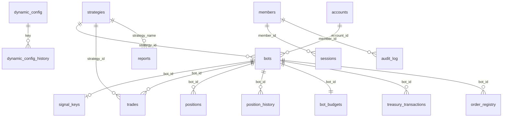

# Ante DB Schema Reference

Ante 시스템의 전체 데이터베이스 스키마를 정리한 문서입니다. 각 테이블의 DDL, 인덱스, ER 다이어그램, 보존 정책을 확인할 수 있습니다.

> 생성 명령: `PYTHONPATH=$PWD/src .venv/bin/python scripts/generate_db_schema.py`
> Check 명령: `PYTHONPATH=$PWD/src .venv/bin/python scripts/generate_db_schema.py --check`
> 마지막 갱신: 2026-05-05

- 테이블: **22**개
- 인덱스: **31**개

## 목차

- [ER 다이어그램](#er-다이어그램)
- [테이블 목록](#테이블-목록)
- [DDL](#ddl)
- [인덱스 목록](#인덱스-목록)
- [보존 정책](#보존-정책)

---

## ER 다이어그램


```mermaid
erDiagram
    accounts ||--o{ bots : "account_id"
    bots ||--o| signal_keys : "bot_id"
    bots ||--o{ trades : "bot_id"
    bots ||--o{ positions : "bot_id"
    bots ||--o{ position_history : "bot_id"
    bots ||--|| bot_budgets : "bot_id"
    bots ||--o{ treasury_transactions : "bot_id"
    bots ||--o{ order_registry : "bot_id"
    strategies ||--o{ bots : "strategy_id"
    strategies ||--o{ trades : "strategy_id"
    strategies ||--o{ reports : "strategy_name"
    dynamic_config ||--o{ dynamic_config_history : "key"
    members ||--o{ sessions : "member_id"
    members ||--o{ audit_log : "member_id"
```

## 테이블 목록

| # | 테이블 | 모듈 | 설명 | 컬럼 수 |
|---|--------|------|------|---------|
| 1 | [accounts](#accounts) | `account` | 계좌 등록 정보 | 16 |
| 2 | [approvals](#approvals) | `approval` | 결재 요청 | 15 |
| 3 | [audit_log](#audit_log) | `audit` | 멤버 액션 감사 로그 | 7 |
| 4 | [backtest_runs](#backtest_runs) | `backtest` | 백테스트 실행 이력 | 11 |
| 5 | [bots](#bots) | `bot` | 봇 등록 정보 | 9 |
| 6 | [signal_keys](#signal_keys) | `bot` | 봇별 시그널 키 | 3 |
| 7 | [order_registry](#order_registry) | `broker` | 주문 ID -> 봇 매핑 | 5 |
| 8 | [dynamic_config](#dynamic_config) | `config` | 동적 설정값 | 4 |
| 9 | [dynamic_config_history](#dynamic_config_history) | `config` | 동적 설정 변경 이력 | 6 |
| 10 | [event_log](#event_log) | `eventbus` | 이벤트 감사 로그 | 6 |
| 11 | [instruments](#instruments) | `instrument` | 종목 메타데이터 | 8 |
| 12 | [members](#members) | `member` | 멤버 (사용자/에이전트) 등록 정보 | 17 |
| 13 | [reports](#reports) | `report` | 전략 리포트 | 20 |
| 14 | [strategies](#strategies) | `strategy` | 전략 등록 정보 | 12 |
| 15 | [positions](#positions) | `trade` | 현재 포지션 | 7 |
| 16 | [position_history](#position_history) | `trade` | 포지션 변동 이력 | 12 |
| 17 | [trades](#trades) | `trade` | 체결 기록 | 17 |
| 18 | [bot_budgets](#bot_budgets) | `treasury` | 봇별 예산 | 8 |
| 19 | [treasury_transactions](#treasury_transactions) | `treasury` | 자금 트랜잭션 이력 | 7 |
| 20 | [treasury_state](#treasury_state) | `treasury` | 계좌별 자산 상태 | 6 |
| 21 | [treasury_daily_snapshots](#treasury_daily_snapshots) | `treasury` | 일간 자산 스냅샷 | 14 |
| 22 | [sessions](#sessions) | `web` | 서버사이드 세션 | 6 |

## DDL

### accounts

모듈: `account.service`

```sql
CREATE TABLE IF NOT EXISTS accounts (
    account_id   TEXT PRIMARY KEY,
    name         TEXT NOT NULL,
    exchange     TEXT NOT NULL,
    currency     TEXT NOT NULL,
    timezone     TEXT NOT NULL DEFAULT 'Asia/Seoul',
    trading_hours_start TEXT NOT NULL DEFAULT '09:00',
    trading_hours_end   TEXT NOT NULL DEFAULT '15:30',
    trading_mode TEXT NOT NULL DEFAULT 'virtual'
        CHECK(trading_mode IN ('virtual', 'live')),
    broker_type  TEXT NOT NULL,
    credentials  TEXT NOT NULL DEFAULT '{}',
    broker_config TEXT NOT NULL DEFAULT '{}',
    buy_commission_rate  REAL NOT NULL DEFAULT 0,
    sell_commission_rate REAL NOT NULL DEFAULT 0,
    status       TEXT NOT NULL DEFAULT 'active'
        CHECK(status IN ('active', 'suspended', 'deleted')),
    created_at   TEXT NOT NULL DEFAULT (datetime('now')),
    updated_at   TEXT NOT NULL DEFAULT (datetime('now'))
);
```

### approvals

모듈: `approval.service`

```sql
CREATE TABLE IF NOT EXISTS approvals (
    id              TEXT PRIMARY KEY,
    type            TEXT NOT NULL,
    status          TEXT NOT NULL DEFAULT 'pending',
    requester       TEXT NOT NULL,
    title           TEXT NOT NULL,
    body            TEXT NOT NULL DEFAULT '',
    params          TEXT NOT NULL DEFAULT '{}',
    reviews         TEXT NOT NULL DEFAULT '[]',
    history         TEXT NOT NULL DEFAULT '[]',
    reference_id    TEXT DEFAULT '',
    expires_at      TEXT DEFAULT '',
    created_at      TEXT DEFAULT (datetime('now')),
    resolved_at     TEXT DEFAULT '',
    resolved_by     TEXT DEFAULT '',
    reject_reason   TEXT DEFAULT ''
);

CREATE INDEX IF NOT EXISTS idx_approvals_status
    ON approvals(status);
CREATE INDEX IF NOT EXISTS idx_approvals_type
    ON approvals(type);
```

### audit_log

모듈: `audit.logger`

```sql
CREATE TABLE IF NOT EXISTS audit_log (
    id          INTEGER PRIMARY KEY AUTOINCREMENT,
    member_id   TEXT NOT NULL,
    action      TEXT NOT NULL,
    resource    TEXT NOT NULL DEFAULT '',
    detail      TEXT DEFAULT '',
    ip          TEXT DEFAULT '',
    created_at  TEXT DEFAULT (datetime('now'))
);

CREATE INDEX IF NOT EXISTS idx_audit_member
    ON audit_log(member_id);
CREATE INDEX IF NOT EXISTS idx_audit_action
    ON audit_log(action);
CREATE INDEX IF NOT EXISTS idx_audit_created
    ON audit_log(created_at);
```

### backtest_runs

모듈: `backtest.run_store`

```sql
CREATE TABLE IF NOT EXISTS backtest_runs (
    run_id           TEXT PRIMARY KEY,
    strategy_name    TEXT NOT NULL,
    strategy_version TEXT NOT NULL,
    params_json      TEXT DEFAULT '{}',
    total_return_pct REAL,
    sharpe_ratio     REAL,
    max_drawdown_pct REAL,
    total_trades     INTEGER,
    win_rate         REAL,
    result_path      TEXT NOT NULL,
    created_at       TEXT DEFAULT (datetime('now'))
);

CREATE INDEX IF NOT EXISTS idx_backtest_runs_strategy
    ON backtest_runs(strategy_name);
```

### bots

모듈: `bot.manager`

```sql
CREATE TABLE IF NOT EXISTS bots (
    bot_id       TEXT PRIMARY KEY,
    name         TEXT NOT NULL DEFAULT '',
    strategy_id  TEXT NOT NULL,
    account_id   TEXT NOT NULL DEFAULT 'test',
    config_json  TEXT NOT NULL,
    auto_start   BOOLEAN DEFAULT 0,
    status       TEXT DEFAULT 'created',
    created_at   TEXT DEFAULT (datetime('now')),
    updated_at   TEXT DEFAULT (datetime('now'))
);

CREATE INDEX IF NOT EXISTS idx_bots_account_id
    ON bots(account_id);
```

### signal_keys

모듈: `bot.signal_key`

```sql
CREATE TABLE IF NOT EXISTS signal_keys (
    key_id       TEXT PRIMARY KEY,
    bot_id       TEXT NOT NULL UNIQUE,
    created_at   TEXT DEFAULT (datetime('now'))
);
```

### order_registry

모듈: `broker.order_registry`

```sql
CREATE TABLE IF NOT EXISTS order_registry (
    order_id    TEXT PRIMARY KEY,
    account_id  TEXT NOT NULL,
    bot_id      TEXT NOT NULL,
    symbol      TEXT NOT NULL,
    created_at  TEXT DEFAULT (datetime('now'))
);

CREATE INDEX IF NOT EXISTS idx_order_registry_bot
    ON order_registry(bot_id);
CREATE INDEX IF NOT EXISTS idx_order_registry_account
    ON order_registry(account_id);
CREATE INDEX IF NOT EXISTS idx_order_registry_account_bot
    ON order_registry(account_id, bot_id);
```

### dynamic_config

모듈: `config.dynamic`

```sql
CREATE TABLE IF NOT EXISTS dynamic_config (
    key       TEXT PRIMARY KEY,
    value     TEXT NOT NULL,
    category  TEXT NOT NULL,
    updated_at TEXT DEFAULT (datetime('now'))
);
```

### dynamic_config_history

모듈: `config.dynamic`

```sql
CREATE TABLE IF NOT EXISTS dynamic_config_history (
    id         INTEGER PRIMARY KEY AUTOINCREMENT,
    key        TEXT NOT NULL,
    old_value  TEXT,
    new_value  TEXT NOT NULL,
    changed_by TEXT NOT NULL,
    changed_at TEXT DEFAULT (datetime('now'))
);

CREATE INDEX IF NOT EXISTS idx_config_history_key
    ON dynamic_config_history(key);
CREATE INDEX IF NOT EXISTS idx_config_history_changed_at
    ON dynamic_config_history(changed_at);
```

### event_log

모듈: `eventbus.history`

```sql
CREATE TABLE IF NOT EXISTS event_log (
    id          INTEGER PRIMARY KEY AUTOINCREMENT,
    event_id    TEXT NOT NULL,
    event_type  TEXT NOT NULL,
    timestamp   TEXT NOT NULL,
    payload     TEXT NOT NULL,
    created_at  TEXT DEFAULT (datetime('now'))
);

CREATE INDEX IF NOT EXISTS idx_event_log_type
    ON event_log(event_type);
CREATE INDEX IF NOT EXISTS idx_event_log_timestamp
    ON event_log(timestamp);
```

### instruments

모듈: `instrument.service`

```sql
CREATE TABLE IF NOT EXISTS instruments (
    symbol           TEXT NOT NULL,
    exchange         TEXT NOT NULL,
    name             TEXT DEFAULT '',
    name_en          TEXT DEFAULT '',
    instrument_type  TEXT DEFAULT '',
    logo_url         TEXT DEFAULT '',
    listed           INTEGER DEFAULT 1,
    updated_at       TEXT DEFAULT (datetime('now')),
    PRIMARY KEY (symbol, exchange)
);

CREATE INDEX IF NOT EXISTS idx_instruments_name
    ON instruments(name);
```

### members

모듈: `member.service`

```sql
CREATE TABLE IF NOT EXISTS members (
    member_id          TEXT PRIMARY KEY,
    type               TEXT NOT NULL,
    role               TEXT NOT NULL DEFAULT 'default',
    org                TEXT NOT NULL DEFAULT 'default',
    name               TEXT NOT NULL DEFAULT '',
    emoji              TEXT NOT NULL DEFAULT '',
    status             TEXT NOT NULL DEFAULT 'active',
    scopes             TEXT NOT NULL DEFAULT '[]',
    token_hash         TEXT DEFAULT '',
    password_hash      TEXT DEFAULT '',
    recovery_key_hash  TEXT DEFAULT '',
    created_at         TEXT DEFAULT (datetime('now')),
    created_by         TEXT DEFAULT '',
    last_active_at     TEXT DEFAULT '',
    suspended_at       TEXT DEFAULT '',
    revoked_at         TEXT DEFAULT '',
    token_expires_at   TEXT DEFAULT ''
);

CREATE INDEX IF NOT EXISTS idx_members_type
    ON members(type);
CREATE INDEX IF NOT EXISTS idx_members_status
    ON members(status);
CREATE INDEX IF NOT EXISTS idx_members_org
    ON members(org);
```

### reports

모듈: `report.store`

```sql
CREATE TABLE IF NOT EXISTS reports (
    report_id          TEXT PRIMARY KEY,
    strategy_name      TEXT NOT NULL,
    strategy_version   TEXT NOT NULL,
    strategy_path      TEXT NOT NULL,
    status             TEXT NOT NULL DEFAULT 'submitted',
    submitted_at       TEXT NOT NULL,
    submitted_by       TEXT DEFAULT 'agent',
    backtest_period    TEXT DEFAULT '',
    total_return_pct   REAL DEFAULT 0.0,
    total_trades       INTEGER DEFAULT 0,
    sharpe_ratio       REAL,
    max_drawdown_pct   REAL,
    win_rate           REAL,
    summary            TEXT DEFAULT '',
    rationale          TEXT DEFAULT '',
    risks              TEXT DEFAULT '',
    recommendations    TEXT DEFAULT '',
    detail_json        TEXT DEFAULT '{}',
    user_notes         TEXT DEFAULT '',
    reviewed_at        TEXT
);

CREATE INDEX IF NOT EXISTS idx_reports_strategy
    ON reports(strategy_name);
CREATE INDEX IF NOT EXISTS idx_reports_status
    ON reports(status);
```

### strategies

모듈: `strategy.registry`

```sql
CREATE TABLE IF NOT EXISTS strategies (
    strategy_id          TEXT PRIMARY KEY,
    name                 TEXT NOT NULL,
    version              TEXT NOT NULL,
    filepath             TEXT NOT NULL,
    status               TEXT NOT NULL DEFAULT 'registered',
    registered_at        TEXT NOT NULL,
    description          TEXT DEFAULT '',
    author_name          TEXT DEFAULT 'agent',
    author_id            TEXT DEFAULT 'agent',
    validation_warnings  TEXT DEFAULT '[]',
    rationale            TEXT DEFAULT '',
    risks                TEXT DEFAULT '[]'
);
```

### positions

모듈: `trade.position`

```sql
CREATE TABLE IF NOT EXISTS positions (
    bot_id           TEXT NOT NULL,
    symbol           TEXT NOT NULL,
    quantity         REAL NOT NULL DEFAULT 0,
    avg_entry_price  REAL NOT NULL DEFAULT 0.0,
    realized_pnl     REAL NOT NULL DEFAULT 0.0,
    updated_at       TEXT DEFAULT (datetime('now')),
    account_id       TEXT NOT NULL,
    PRIMARY KEY (account_id, bot_id, symbol)
);
```

### position_history

모듈: `trade.position`

```sql
CREATE TABLE IF NOT EXISTS position_history (
    id             INTEGER PRIMARY KEY AUTOINCREMENT,
    bot_id         TEXT NOT NULL,
    symbol         TEXT NOT NULL,
    action         TEXT NOT NULL,
    quantity       REAL NOT NULL,
    price          REAL NOT NULL,
    pnl            REAL DEFAULT 0.0,
    timestamp      TEXT,
    created_at     TEXT DEFAULT (datetime('now')),
    account_id     TEXT NOT NULL,
    exchange       TEXT DEFAULT 'KRX',
    trade_id       TEXT
);

CREATE INDEX IF NOT EXISTS idx_position_history_bot
    ON position_history(bot_id, timestamp);
CREATE INDEX IF NOT EXISTS idx_position_history_account
    ON position_history(account_id, bot_id, timestamp);
```

### trades

모듈: `trade.recorder`

```sql
CREATE TABLE IF NOT EXISTS trades (
    trade_id       TEXT PRIMARY KEY,
    bot_id         TEXT NOT NULL,
    strategy_id    TEXT NOT NULL,
    symbol         TEXT NOT NULL,
    side           TEXT NOT NULL,
    quantity       REAL NOT NULL,
    price          REAL NOT NULL,
    status         TEXT NOT NULL,
    order_type     TEXT DEFAULT '',
    reason         TEXT DEFAULT '',
    commission     REAL DEFAULT 0.0,
    timestamp      TEXT,
    order_id       TEXT,
    created_at     TEXT DEFAULT (datetime('now')),
    account_id     TEXT NOT NULL,
    currency       TEXT DEFAULT 'KRW',
    exchange       TEXT DEFAULT 'KRX'
);

CREATE INDEX IF NOT EXISTS idx_trades_account
    ON trades(account_id, timestamp);
CREATE INDEX IF NOT EXISTS idx_trades_bot
    ON trades(bot_id, timestamp);
CREATE INDEX IF NOT EXISTS idx_trades_strategy
    ON trades(strategy_id, timestamp);
CREATE INDEX IF NOT EXISTS idx_trades_symbol
    ON trades(symbol, timestamp);
CREATE INDEX IF NOT EXISTS idx_trades_status
    ON trades(status);
```

### bot_budgets

모듈: `treasury.treasury`

```sql
CREATE TABLE IF NOT EXISTS bot_budgets (
    bot_id       TEXT PRIMARY KEY,
    account_id   TEXT NOT NULL,
    allocated    REAL NOT NULL DEFAULT 0.0,
    available    REAL NOT NULL DEFAULT 0.0,
    reserved     REAL NOT NULL DEFAULT 0.0,
    spent        REAL NOT NULL DEFAULT 0.0,
    returned     REAL NOT NULL DEFAULT 0.0,
    last_updated TEXT DEFAULT (datetime('now'))
);

CREATE INDEX IF NOT EXISTS idx_bot_budgets_account
    ON bot_budgets(account_id);
```

### treasury_transactions

모듈: `treasury.treasury`

```sql
CREATE TABLE IF NOT EXISTS treasury_transactions (
    id               INTEGER PRIMARY KEY AUTOINCREMENT,
    bot_id           TEXT,
    account_id       TEXT NOT NULL,
    transaction_type TEXT NOT NULL,
    amount           REAL NOT NULL,
    description      TEXT DEFAULT '',
    created_at       TEXT DEFAULT (datetime('now'))
);

CREATE INDEX IF NOT EXISTS idx_treasury_transactions_account
    ON treasury_transactions(account_id);
```

### treasury_state

모듈: `treasury.treasury`

```sql
CREATE TABLE IF NOT EXISTS treasury_state (
    account_id         TEXT PRIMARY KEY,
    account_balance    REAL NOT NULL DEFAULT 0,
    purchasable_amount REAL NOT NULL DEFAULT 0,
    total_evaluation   REAL NOT NULL DEFAULT 0,
    currency           TEXT NOT NULL DEFAULT 'KRW',
    last_synced_at     TEXT
);
```

### treasury_daily_snapshots

모듈: `treasury.treasury`

```sql
CREATE TABLE IF NOT EXISTS treasury_daily_snapshots (
    account_id           TEXT    NOT NULL,
    snapshot_date        TEXT    NOT NULL,
    total_asset          REAL    NOT NULL DEFAULT 0,
    ante_eval_amount     REAL    NOT NULL DEFAULT 0,
    ante_purchase_amount REAL    NOT NULL DEFAULT 0,
    unallocated          REAL    NOT NULL DEFAULT 0,
    account_balance      REAL    NOT NULL DEFAULT 0,
    total_allocated      REAL    NOT NULL DEFAULT 0,
    bot_count            INTEGER NOT NULL DEFAULT 0,
    daily_pnl            REAL    DEFAULT 0.0,
    daily_return         REAL    DEFAULT 0.0,
    net_trade_amount     REAL    DEFAULT 0.0,
    unrealized_pnl       REAL    DEFAULT 0.0,
    created_at           TEXT    DEFAULT (datetime('now')),
    PRIMARY KEY (account_id, snapshot_date)
);
```

### sessions

모듈: `web.session`

```sql
CREATE TABLE IF NOT EXISTS sessions (
    session_id    TEXT PRIMARY KEY,
    member_id     TEXT NOT NULL,
    created_at    TEXT NOT NULL DEFAULT (datetime('now')),
    expires_at    TEXT NOT NULL,
    ip_address    TEXT DEFAULT '',
    user_agent    TEXT DEFAULT ''
);

CREATE INDEX IF NOT EXISTS idx_sessions_member_id
    ON sessions(member_id);
CREATE INDEX IF NOT EXISTS idx_sessions_expires_at
    ON sessions(expires_at);
```

## 인덱스 목록

| # | 인덱스명 | 테이블 | 컬럼 |
|---|----------|--------|------|
| 1 | `idx_approvals_status` | `approvals` | `status` |
| 2 | `idx_approvals_type` | `approvals` | `type` |
| 3 | `idx_audit_member` | `audit_log` | `member_id` |
| 4 | `idx_audit_action` | `audit_log` | `action` |
| 5 | `idx_audit_created` | `audit_log` | `created_at` |
| 6 | `idx_backtest_runs_strategy` | `backtest_runs` | `strategy_name` |
| 7 | `idx_bots_account_id` | `bots` | `account_id` |
| 8 | `idx_order_registry_bot` | `order_registry` | `bot_id` |
| 9 | `idx_order_registry_account` | `order_registry` | `account_id` |
| 10 | `idx_order_registry_account_bot` | `order_registry` | `account_id, bot_id` |
| 11 | `idx_config_history_key` | `dynamic_config_history` | `key` |
| 12 | `idx_config_history_changed_at` | `dynamic_config_history` | `changed_at` |
| 13 | `idx_event_log_type` | `event_log` | `event_type` |
| 14 | `idx_event_log_timestamp` | `event_log` | `timestamp` |
| 15 | `idx_instruments_name` | `instruments` | `name` |
| 16 | `idx_members_type` | `members` | `type` |
| 17 | `idx_members_status` | `members` | `status` |
| 18 | `idx_members_org` | `members` | `org` |
| 19 | `idx_reports_strategy` | `reports` | `strategy_name` |
| 20 | `idx_reports_status` | `reports` | `status` |
| 21 | `idx_position_history_bot` | `position_history` | `bot_id, timestamp` |
| 22 | `idx_position_history_account` | `position_history` | `account_id, bot_id, timestamp` |
| 23 | `idx_trades_account` | `trades` | `account_id, timestamp` |
| 24 | `idx_trades_bot` | `trades` | `bot_id, timestamp` |
| 25 | `idx_trades_strategy` | `trades` | `strategy_id, timestamp` |
| 26 | `idx_trades_symbol` | `trades` | `symbol, timestamp` |
| 27 | `idx_trades_status` | `trades` | `status` |
| 28 | `idx_bot_budgets_account` | `bot_budgets` | `account_id` |
| 29 | `idx_treasury_transactions_account` | `treasury_transactions` | `account_id` |
| 30 | `idx_sessions_member_id` | `sessions` | `member_id` |
| 31 | `idx_sessions_expires_at` | `sessions` | `expires_at` |

## 보존 정책

| 테이블 | 정책 |
|--------|------|
| `accounts` | 영구 보존 |
| `approvals` | 영구 보존 |
| `audit_log` | 영구 보존 |
| `backtest_runs` | 영구 보존 |
| `bots` | 영구 보존 |
| `signal_keys` | 영구 보존 |
| `order_registry` | 영구 보존 |
| `dynamic_config` | 영구 보존 |
| `dynamic_config_history` | 90일 후 삭제 |
| `event_log` | 30일 후 삭제 |
| `instruments` | 영구 보존 |
| `members` | 영구 보존 |
| `reports` | 영구 보존 |
| `strategies` | 영구 보존 |
| `positions` | 영구 보존 |
| `position_history` | 영구 보존 |
| `trades` | 영구 보존 |
| `bot_budgets` | 영구 보존 |
| `treasury_transactions` | 영구 보존 |
| `treasury_state` | 영구 보존 |
| `treasury_daily_snapshots` | 영구 보존 |
| `sessions` | 만료 후 삭제 |

