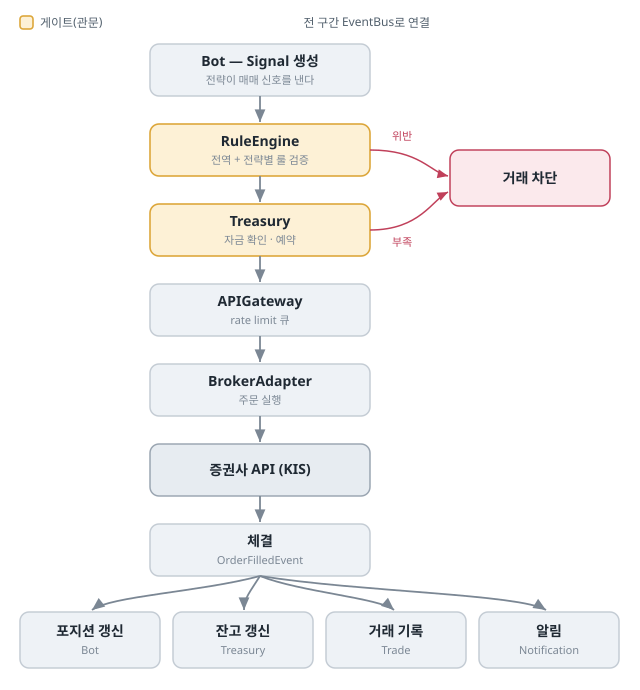
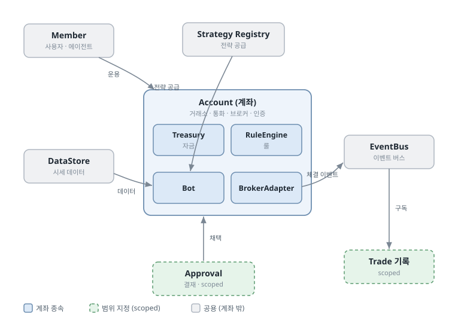

# 핵심 개념

Ante를 처음 보는 사람과 에이전트를 위한 문서입니다. "무엇이 있고, 어떻게 맞물려 돌아가는가"를 한 번에 잡는 것을 목표로 합니다.

## 한 문장 배경

AI 에이전트에게 트레이딩 전권을 맡기기엔 리스크가 있고, 기존 자동매매 시스템은 경직되어 자율성이 부족했습니다. Ante는 트레이딩 안전 게이트로 기능하여 AI 트레이딩 에이전트의 잠재성을 최대한 지원하려는 목적으로 만들었습니다.

## 멘탈 모델: AI 트레이더와 그를 받치는 미들·백오피스

Ante는 개인 홈서버에서 도는, AI 트레이더를 받치는 미들·백오피스 인프라입니다. 투자회사 조직에 빗대면 역할이 이렇게 나뉩니다.

- **프론트오피스 — AI 에이전트** : 시장을 보고 전략을 짜서 매매를 결정합니다. (자율)
- **미들·백오피스 — Ante** : 그 결정이 실거래로 가기 전에 검증·룰·승인으로 거르고(리스크 관리), 체결 후 정산·기록합니다(정산·기록).
- **오너 — 개인 사용자** : 무엇을 운용할지 최종 결정합니다.

Ante 자신은 매매를 결정하지 않습니다. 결정하는 건 프론트(에이전트)이고, Ante는 그 자율이 사고로 번지지 않게 받치는 후방입니다. 그래서 핵심은 **자율과 게이트의 분담**입니다 — 무엇을 거래할지는 에이전트가 자유롭게 정하고(자율), 그 판단이 실제 자본에 닿기 전에 Ante가 관문을 둡니다(게이트).

## 그래서 어떻게 동작하는가 — 전략의 일생

전략 하나가 아이디어에서 실거래까지 가는 길입니다. 가운데 색칠된 세 단계가 **게이트**입니다.

1. **작성** — 에이전트가 전략을 Python 클래스로 작성합니다. (자율)
2. **정적 검증** — 금지된 임포트·필수 구조를 AST로 확인합니다. (게이트 1)
3. **백테스트** — 과거 데이터로 성과를 시뮬레이션합니다. 격리된 subprocess에서 돌아갑니다. (게이트 2)
4. **승인** — 백테스트 리포트를 근거로 사용자가 채택을 결재합니다. (게이트 3)
5. **봇 가동** — 채택된 전략을 봇에 실어 실행합니다.
6. **운영·모니터링** — 거래가 기록되고 성과 지표가 쌓입니다. 그 피드백이 다음 전략으로 돌아갑니다.

## 그래서 어떻게 동작하는가 — 주문 한 건의 흐름

봇이 운영 중 매매 신호(Signal)를 낼 때, 그 주문이 거치는 길입니다. 여기서도 색칠된 단계가 게이트입니다.

- 모든 단계는 **EventBus**를 통해 이어집니다. (`OrderRequestEvent` → `OrderValidatedEvent` → `OrderApprovedEvent` → `OrderFilledEvent`)
- **거래 룰**(전역 + 전략별)과 **자금 확인**이 실거래 직전의 런타임 게이트입니다. 전략이 아무리 자유로워도 이 둘을 통과하지 못하면 주문은 차단됩니다.
- 체결 결과는 한 번에 여러 곳으로 퍼집니다 — 포지션·잔고·기록·알림.

## 자율은 어디까지, 게이트는 무엇인가

Ante의 설계를 한 표로 요약하면 이렇습니다.

| 구분 | 누가/무엇이 | 내용 |
|------|------------|------|
| **자율** | 에이전트 | 무엇을·언제·얼마나 사고팔지 (전략 로직, Signal) |
| 게이트 ① | 정적 검증 | 위험한 코드·구조를 사전 차단 |
| 게이트 ② | 백테스트 | 과거 데이터로 성과를 검증 |
| 게이트 ③ | 승인 | 실자본 투입 전 사용자 최종 결재 |
| 게이트 ④ | 거래 룰 + 자금 | 운영 중 매 주문을 전역·전략별 룰과 가용 자금으로 검증 |

게이트는 자율을 막으려는 게 아니라, **안심하고 풀어주기 위한 장치**입니다.

## 개념 관계도

각 개념이 무엇에 속하고 무엇과 이어지는지를 한 장으로 본 그림입니다. 많은 것이 **계좌(Account)** 를 중심으로 모입니다.

- **계좌에 종속** (계좌가 사라지면 함께 사라짐): Treasury, RuleEngine, Bot, BrokerAdapter
- **계좌로 범위 지정**: Trade 기록, Approval, 전략 성과
- **계좌 밖 (공용)**: Member, Strategy Registry, DataStore, EventBus, Backtest

## 주요 모듈로 이어 보기

여기까지가 Ante의 큰 흐름입니다. 각 모듈이 정확히 무엇을 의미하고 어떤 CLI 명령 그룹이 무엇을 제어하는지는 [모듈과 운영 영역](modules.md)에서 이어서 봅니다.

특히 처음 운용한다면 `account`와 `broker`, `treasury`의 차이, `data`와 `feed`의 차이, `strategy`와 `bot`의 차이를 먼저 확인하는 것이 좋습니다.

## 다음 단계

개념이 잡혔다면, [모듈과 운영 영역](modules.md)에서 명령 그룹별 제어 대상을 확인하고 [시작하기](getting-started.md)에서 설치부터 첫 전략 가동까지 직접 따라가 볼 수 있습니다. 전략을 직접 쓰려면 [전략 작성 가이드](strategy.md)를, 에이전트로 일한다면 [에이전트 가이드](agent.md)를 보세요. 더 깊은 동작 원리는 [아키텍처 문서](../docs/architecture/README.md)에 있습니다.
